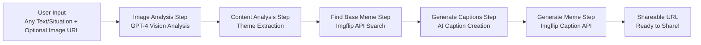
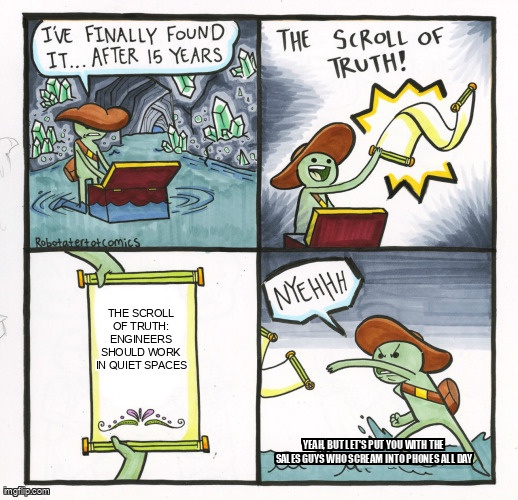
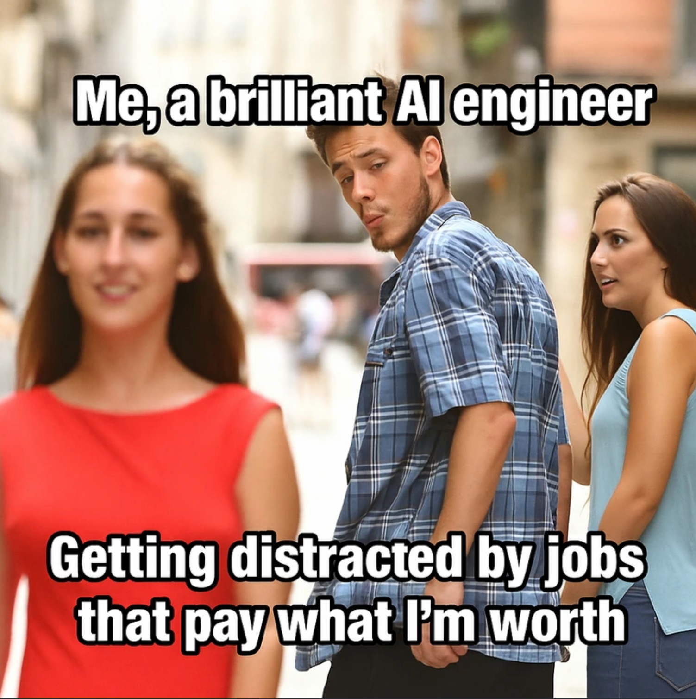
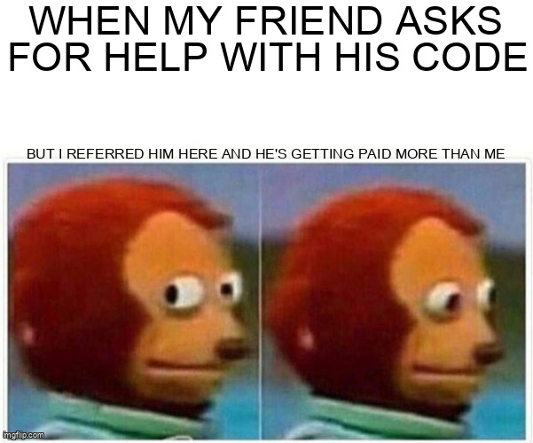
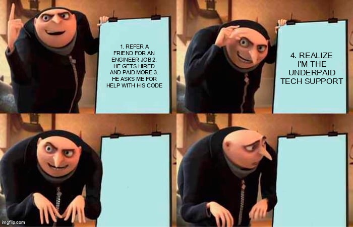

# AI Pipelines and Agents in Pure TypeScript with Mastra.ai

Welcome to this hands-on workshop! This project demonstrates how to build **production-ready AI agents and workflows** using Mastra to create a fun meme generation pipeline that turns **any text or situation** into shareable memes, with optional image analysis capabilities and **intelligent memory powered by Mem0**.

## 🎬 Workshop Video Tutorial

Watch the demo of this application runnning end to end:

[](https://www.youtube.com/watch?v=oZmaBSuxZVA)

🎥 **Click above to watch the full workshop video!**

While we've chosen a humorous implementation example, the **patterns, architecture, and Mastra framework** you'll learn here are ideal for creating **enterprise-grade agentic applications**. The same workflow concepts apply whether you're building customer support automation, data processing pipelines, or complex business logic orchestration.

## 🎯 What You'll Learn

- **Mastra Agents**: Build conversational AI agents that can understand user input
- **Mastra Workflows**: Create modular workflow steps that can be chained together
- **Structured Generation**: Use Vercel AI SDK with Zod schemas for reliable data extraction
- **External API Integration**: Connect to meme services (Imgflip) for meme generation
- **Image Analysis**: Use GPT-4 Vision to analyze images and incorporate them into meme generation
- **Agentic Workflows**: Chain multiple steps together to create complex workflows
- **Intelligent Memory**: Implement persistent memory with Mem0 for personalized experiences

## 🧠 Understanding the Workflow

### The Meme Generation Pipeline

Our workshop demonstrates a complete agentic workflow that works with any content:



### Key Components

1. **Image Analysis Step**: Detects image URLs in input and analyzes them using GPT-4 Vision
2. **Content Analysis Step**: Uses structured generation to parse any kind of user input into themes and emotional context
3. **Meme Search Step**: Searches Imgflip's free API for appropriate base meme templates
4. **Caption Generation Step**: Creates witty, contextual captions based on content analysis and meme template
5. **Meme Generation Step**: Uses Imgflip's caption API to create memes with the base template and captions

## 🎭 Example Generated Memes

Here are some actual memes generated by our workshop application, showcasing how work frustrations get transformed into shareable humor:

### Open Office Nightmares → Workplace Reality


*When they move all the engineers to an open floor plan with noisy co-workers...*

### Compensation Blues → The Talent Paradox  


*Being told you're excellent at your job but somehow still underpaid...*

### The Helper's Dilemma → Salary Irony


*When you refer an engineer who constantly asks for your help but gets paid more than you...*



*That awkward moment when your mentee's starting salary is higher than your current one...*

These examples demonstrate how our AI workflow transforms common workplace frustrations into contextually appropriate and genuinely funny memes that teams can actually share!

## 🚀 Quick Start

### Prerequisites

- Node.js 20.9.0+
- OpenAI API key (for caption generation)
- Optional: Imgflip account credentials (for better rate limits and reliability)
- Basic knowledge of Next.js and TypeScript

### 1. Clone and Install

```bash
git clone <your-repo-url>
cd mastra-workshop-test
npm install
```

### 2. Environment Setup

Create a `.env` file with your API keys:

```env
# OpenAI Configuration (required for caption generation)
OPENAI_API_KEY=your_openai_api_key_here

# Mem0 Configuration (required for intelligent memory)
MEM0_API_KEY=your_mem0_api_key_here

# Optional: Imgflip credentials for meme generation (recommended for better reliability)
IMGFLIP_USERNAME=your_imgflip_username
IMGFLIP_PASSWORD=your_imgflip_password
```

**Getting Your API Keys:**

1. **OpenAI API Key**: Get it from [OpenAI Platform](https://platform.openai.com/api-keys)
2. **Mem0 API Key**: Sign up at [app.mem0.ai](https://app.mem0.ai) and create a new project
3. **Imgflip Credentials** (Optional): Create a free account at [Imgflip](https://imgflip.com/signup)

**Note:** The app will work without Imgflip credentials using a default account, but may be rate limited.

### 3. Test Mem0 Integration (Optional)

Test your Mem0 configuration with the included test script:

```bash
node test-mem0.js
```

This will verify your Mem0 API key is working correctly.

### 4. Start the Development Server

```bash
npm run dev
```

Visit [http://localhost:4111](http://localhost:4111) to start generating memes!

## 🐳 Docker Deployment

### Quick Docker Setup

If you prefer to run the application in a containerized environment, we've included complete Docker support:

```bash
# 1. Clone and setup environment
git clone <your-repo-url>
cd mastra-agents-meme-generator
cp env.example .env
# Edit .env with your API keys

# 2. Run with Docker Compose (Production)
docker-compose up -d

# 3. Or run in development mode with hot reload
docker-compose --profile dev up -d mastra-dev

# 4. For Tawk.to webhook integration
docker-compose up -d mastra-app mastra-webhook  # Production
docker-compose --profile dev up -d mastra-dev mastra-webhook-dev  # Development
```

### Docker Benefits

- **🔒 Consistent Environment**: Same runtime across development, staging, and production
- **📦 Easy Deployment**: Deploy to any platform that supports Docker
- **🔄 Hot Reload**: Development mode supports live code changes
- **💾 Data Persistence**: Database files and logs are automatically persisted in `/data/mastra-ai`
- **🏥 Health Checks**: Built-in health monitoring and automatic restarts

### Docker Commands

```bash
# View logs
docker-compose logs -f mastra-app

# Stop containers
docker-compose down

# Rebuild and restart
docker-compose up -d --build

# Access container shell
docker-compose exec mastra-app sh
```

### Makefile Support

For easier Docker operations, use the included Makefile:

```bash
# Show all available commands
make help

# Quick setup: login, build, and push to Docker Hub
make login
make build
make push

# Development workflow
make run-dev            # Start development with hot reload
make logs               # View logs
make stop               # Stop containers

# Tawk.to webhook integration
make run-all            # Start both main app and webhook (production)
make run-all-dev        # Start both main app and webhook (development)
make logs-webhook       # View webhook logs

# Create a versioned release
make release VERSION=1.0.0
```

**Images available at:** `docker.io/jeffpascal/mastra-meme-generator`

For comprehensive Docker setup instructions, deployment options, and troubleshooting, see **[DOCKER.md](./DOCKER.md)**.

## 🤖 How It Works

### The Meme Agent

Our main agent understands user frustrations and orchestrates the meme generation process:

```typescript
// Simplified agent structure
const memeGeneratorAgent = new Agent({
  name: 'MemeGenerator',
  instructions: 'Help users turn their work frustrations into funny memes',
  workflows: {
    'meme-generation': memeGenerationWorkflow,
  },
});
```

### Workflow Architecture

Each step in our workflow is designed to be:

- **Modular**: Can be used independently or as part of the workflow
- **Typed**: Uses Zod schemas for input/output validation
- **Testable**: Can be tested in isolation using Mastra's built-in tools
- **Reusable**: Can be composed into different workflows

## 🛠️ Workflow Steps Deep Dive

### 1. Extract Frustrations Step

```typescript
const extractFrustrationsStep = createStep({
  id: 'extract-frustrations',
  description: 'Extract and categorize user frustrations from raw input',
  inputSchema: z.object({
    userInput: z.string().describe('Raw user input about work frustrations'),
  }),
  execute: async ({ inputData }) => {
    // Uses Vercel AI SDK with structured generation
    const result = await generateObject({
      model: openai('gpt-4'),
      schema: frustrationsSchema,
      prompt: `Extract frustrations from: ${inputData.userInput}`,
    });
    return result.object;
  },
});
```

### 2. Find Base Meme Step

```typescript
const findBaseMemeStep = createStep({
  id: 'find-base-meme',
  description: "Get a diverse selection of meme templates from Imgflip's free API",
  inputSchema: frustrationsSchema.extend({
    analysis: z.object({
      message: z.string(),
    }),
  }),
  execute: async ({ inputData }) => {
    // Search Imgflip's free API for relevant meme templates
    const response = await fetch('https://api.imgflip.com/get_memes');
    const data = await response.json();
    const selectedMemes = data.data.memes.slice(0, 10);
    return { templates: selectedMemes };
  },
});
```

### 3. Generate Captions Step

```typescript
const generateCaptionsStep = createStep({
  id: 'generate-captions',
  description: 'Generate meme captions based on frustrations and template',
  inputSchema: z.object({
    frustrations: frustrationsSchema,
    baseTemplate: memeTemplateSchema,
  }),
  execute: async ({ inputData }) => {
    // Generate contextual, funny captions using AI
    const captions = await generateObject({
      model: openai('gpt-4'),
      schema: captionsSchema,
      prompt: `Create funny captions for ${inputData.baseTemplate.name} based on: ${inputData.frustrations}`,
    });
    return captions.object;
  },
});
```

### 4. Generate Meme Step

```typescript
const generateMemeStep = createStep({
  id: 'generate-meme',
  description: "Create a meme using Imgflip's caption API with the selected template and captions",
  inputSchema: z.object({
    baseTemplate: memeTemplateSchema,
    captions: captionsSchema,
  }),
  execute: async ({ inputData }) => {
    // Use Imgflip's caption_image API to create meme with specific template and text
    const formData = new URLSearchParams();
    formData.append('template_id', inputData.baseTemplate.id);
    formData.append('username', process.env.IMGFLIP_USERNAME || 'imgflip_hubot');
    formData.append('password', process.env.IMGFLIP_PASSWORD || 'imgflip_hubot');
    formData.append('text0', inputData.captions.topText);
    formData.append('text1', inputData.captions.bottomText);

    const response = await fetch('https://api.imgflip.com/caption_image', {
      method: 'POST',
      headers: { 'Content-Type': 'application/x-www-form-urlencoded' },
      body: formData,
    });
    
    const result = await response.json();
    // Imgflip provides a stable, shareable URL that can be used directly
    return { imageUrl: result.data.url, pageUrl: result.data.page_url };
  },
});
```

## 🧠 Intelligent Memory with Mem0

This project now includes intelligent memory capabilities powered by Mem0, enabling the meme generator to:

### 🏗️ **Dual Storage Architecture**
- **Mastra System Storage**: Uses LibSQL for core system operations (telemetry, workflow state)
- **Agent Memory**: Uses Mem0 for intelligent, personalized user memory and preferences
- **Separation of Concerns**: System storage and agent memory are completely separate

### 🎯 **Personalization Features**
- **Remember User Preferences**: Language preferences, favorite meme styles, and topics
- **Learn from Success**: Track which memes work well for each user
- **Context Awareness**: Build on previous conversations and meme requests
- **Smart Recommendations**: Suggest meme formats based on past successful generations

### 🔧 **Memory Tools**
The agent has access to two powerful memory tools:

1. **Mem0-memorize**: Automatically saves important information like:
   - User's preferred meme formats (Drake, Distracted Boyfriend, etc.)
   - Language preferences (Spanish, French, German, etc.)
   - Successful meme themes and topics
   - User feedback and preferences

2. **Mem0-remember**: Retrieves relevant information such as:
   - Previous successful meme patterns
   - User's favorite styles and formats
   - Language and content preferences
   - Historical context from past conversations

### 🚀 **Enhanced User Experience**
- **First-time users**: Get standard meme generation
- **Returning users**: Receive increasingly personalized meme recommendations
- **Contextual requests**: "Make another one like the last one" or "Use my preferred style"
- **Cross-session memory**: Preferences persist across different conversation sessions
- **Multi-language support**: Automatic language detection with intelligent character normalization

### 🔤 **Romanian Character Normalization**
The system automatically normalizes Romanian special characters for better meme compatibility:
- **ă, â → a** | **Ă, Â → A**
- **î → i** | **Î → I** 
- **ș → s** | **Ș → S**
- **ț → t** | **Ț → T**

This ensures memes display correctly across all platforms and meme generators, while preserving the original meaning and humor in Romanian.

## 🧪 Testing Your Workflow

### Local Testing with Mastra

Mastra provides excellent built-in capabilities for testing your workflows:

```bash
# Start the development server to test interactively
npm run dev

# Visit the Mastra playground at http://localhost:4111
# Use the chat interface to test the complete workflow
```

### Example Test Cases

1. **Simple Frustration**: "My meetings always run over time"
2. **Complex Frustration**: "The deployment process is broken, code reviews take forever, and our standup meetings are pointless"
3. **Emotional Frustration**: "I'm so tired of explaining the same thing over and over to different stakeholders"

## 🎨 Customization Ideas

### Meme Styles

- **Corporate Humor**: Professional-looking memes safe for work
- **Developer Memes**: Programming and tech-specific templates
- **Remote Work**: Memes about working from home challenges
- **Meeting Memes**: Specifically about meeting frustrations

### Integration Options

- **Slack Bot**: Deploy as a Slack app for team use
- **Teams Integration**: Microsoft Teams bot for enterprise
- **Discord Bot**: For gaming/tech communities
- **Web Widget**: Embeddable meme generator for websites

## 📖 Learn More

### Documentation

- [Mastra Documentation](https://mastra.ai/docs)
- [Vercel AI SDK](https://sdk.vercel.ai/docs)
- [OpenAI API Documentation](https://platform.openai.com/docs)
- [Imgflip API](https://imgflip.com/api)

### Key Concepts

- **Agent Orchestration**: How agents coordinate multiple workflow steps
- **Structured Generation**: Reliable data extraction from LLMs
- **Workflow Composition**: Building complex workflows from simple steps
- **Error Handling**: Graceful failure and recovery in agentic systems
- **Testing Strategies**: How to test AI-powered workflows

## 🎉 Workshop Goals

By the end of this workshop, you'll have:

- ✅ Built a complete agentic workflow with multiple specialized steps
- ✅ Integrated external APIs (Imgflip, OpenAI)
- ✅ Used structured generation for reliable data extraction
- ✅ Created a fun, shareable application that solves real problems
- ✅ Learned Mastra's agent and workflow patterns
- ✅ Gained experience with AI-powered workflows and step composition

## 🤝 Contributing

Found an issue or want to improve the workshop? Please open an issue or submit a pull request!

## 📄 License

MIT License - feel free to use this code for your own projects and workshops.

---

**Happy meme generating!** 🎭 Turn those work frustrations into laughs and learn about agentic AI workflows in the process!
