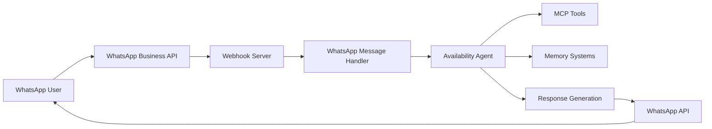

# WhatsApp Business API Webhook for Mastra Availability Agent

This document provides a complete guide for setting up a WhatsApp Business API webhook that integrates with the Mastra availability agent for property booking and management.

## 🎯 Overview

The WhatsApp webhook enables users to interact with the availability agent via WhatsApp messages, allowing them to:

- Check property availability for specific dates
- Get information about available properties
- Create booking links
- Receive personalized responses with memory integration

## 🚀 Quick Start

### 1. Prerequisites

Before setting up the webhook, ensure you have:

- **WhatsApp Business Account**: A verified WhatsApp Business Account through Meta for Developers
- **Meta App**: A Business app in the Meta App Dashboard with WhatsApp Product added
- **Phone Number**: A WhatsApp Business phone number registered with Meta
- **API Credentials**: Access token and phone number ID from Meta
- **Mastra Setup**: Working Mastra environment with the availability agent
- **MCP Server**: Running MCP server for property data (if using external services)

### 2. Environment Configuration

Copy the environment variables to your `.env` file:

```env
# WhatsApp Business API Configuration
WHATSAPP_ACCESS_TOKEN=your_whatsapp_access_token_here
WHATSAPP_PHONE_NUMBER_ID=your_phone_number_id_here
WHATSAPP_VERIFY_TOKEN=your_custom_verify_token_here
WEBHOOK_PORT=3001

# OpenAI Configuration (required for AI responses)
OPENAI_API_KEY=your_openai_api_key_here

# Mem0 Configuration (required for memory features)
MEM0_API_KEY=your_mem0_api_key_here
```

### 3. Getting WhatsApp API Credentials

#### Step 1: Create Meta App
1. Go to [Meta for Developers](https://developers.facebook.com/)
2. Create a new Business App
3. Add the WhatsApp Product to your app

#### Step 2: Get Access Token
1. In your Meta App Dashboard, go to WhatsApp → Getting Started
2. Copy the temporary access token (for testing) or generate a permanent one
3. Set this as `WHATSAPP_ACCESS_TOKEN`

#### Step 3: Get Phone Number ID
1. In WhatsApp → Getting Started, find your test phone number
2. Copy the Phone Number ID
3. Set this as `WHATSAPP_PHONE_NUMBER_ID`

#### Step 4: Set Verify Token
1. Choose a custom verification token (keep it secret!)
2. Set this as `WHATSAPP_VERIFY_TOKEN`

### 4. Start the Webhook Server

```bash
# Install dependencies if not already done
npm install

# Start the webhook server
npm run webhook:whatsapp
```

The server will start on port 3001 (or your configured `WEBHOOK_PORT`) and display:

```
🚀 WhatsApp Webhook Server running on port 3001
📱 WhatsApp webhook URL: http://localhost:3001/webhooks/whatsapp
🔍 Health check: http://localhost:3001/health
ℹ️  Server info: http://localhost:3001/
```

## 🔧 Webhook Configuration in Meta

### 1. Configure Webhook URL

1. In your Meta App Dashboard, go to WhatsApp → Configuration
2. Set the webhook URL to: `https://your-domain.com/webhooks/whatsapp`
   - For local testing with ngrok: `https://your-ngrok-url.ngrok.io/webhooks/whatsapp`
3. Set the verify token to match your `WHATSAPP_VERIFY_TOKEN`
4. Subscribe to the `messages` field

### 2. Webhook Fields

Subscribe to these webhook fields:
- ✅ **messages** - Required for receiving user messages

### 3. Local Development with ngrok

For local testing, use ngrok to expose your local server:

```bash
# Install ngrok if not already installed
npm install -g ngrok

# Expose local port 3001
ngrok http 3001
```

Use the generated ngrok URL as your webhook URL in Meta Dashboard.

## 📱 Usage Examples

Once configured, users can interact with your WhatsApp Business number:

### Basic Availability Queries

**User**: "Hello, I need a place to stay"  
**Agent**: "Hello! I'd be happy to help you find accommodation. 🏨 To get started, could you let me know:
- What dates are you looking for?
- How many guests?
- Any specific property preferences?"

**User**: "I need accommodation from June 15 to June 20 for 2 people"  
**Agent**: "Perfect! Let me check availability for June 15-20 for 2 guests. 🔍"

*[Agent searches available properties and responds with options]*

### Property-Specific Queries

**User**: "Is Casa Pescarului available next month?"  
**Agent**: "Let me check Casa Pescarului availability for next month... 🏡"

*[Agent checks specific property and responds with availability]*

### Booking Creation

**User**: "I want to book Casa Pescarului from July 10 to July 15"  
**Agent**: "Great choice! Casa Pescarului is available July 10-15. Here's your booking link: [booking_url] 🎉"

## 🧠 Memory Integration

The webhook integrates with both Mastra's built-in memory and Mem0 for intelligent conversations:

### Automatic Memory (Mastra)
- Tracks conversation context automatically
- Remembers user preferences within the session
- Maintains conversation flow seamlessly

### Explicit Memory (Mem0)
- Stores user preferences across sessions
- Remembers successful booking patterns
- Learns from user interactions

### Example Memory Usage

**First interaction:**
**User**: "I'm looking for a romantic getaway for 2 people"  
**Agent**: *[Provides recommendations and saves preference for romantic properties]*

**Later interaction:**
**User**: "Do you have anything available?"  
**Agent**: "Based on your preference for romantic getaways, I'd recommend checking Casa Pescariului or Vila Franceza. What dates are you thinking? 💕"

## 🛠️ Technical Architecture

### Webhook Flow



### Key Components

1. **WhatsApp Webhook Handler** (`src/mastra/webhooks/whatsapp.ts`)
   - Verifies webhook requests from Meta
   - Processes incoming messages
   - Sends responses via WhatsApp API

2. **Express Server** (`src/mastra/webhooks/server.ts`)
   - Serves webhook endpoints
   - Handles HTTPS requirements
   - Provides health checks

3. **Availability Agent** (`src/mastra/agents/availability-agent.ts`)
   - Processes user queries
   - Integrates with property systems
   - Manages memory and context

4. **MCP Tools** (`src/mastra/tools/availability.ts`)
   - Interfaces with property management systems
   - Provides availability data
   - Creates booking links

## 🔒 Security Considerations

### Webhook Verification
- Always verify webhook requests using the verify token
- Validate payload structure with Zod schemas
- Use HTTPS for all webhook communications

### API Security
- Keep WhatsApp access tokens secure and rotate regularly
- Use environment variables for all sensitive data
- Implement rate limiting if needed

### Data Privacy
- Follow WhatsApp Business API policies
- Respect user privacy and data protection laws
- Don't store sensitive user data unnecessarily

## 🚨 Error Handling

The webhook includes comprehensive error handling:

### Message Processing Errors
- Invalid webhook payloads are rejected gracefully
- Agent failures result in helpful error messages
- API failures include fallback contact information

### Retry Logic
- WhatsApp automatically retries failed webhooks for up to 7 days
- Webhook acknowledges receipt immediately to prevent duplicates
- Failed message sends are logged for debugging

### Common Issues and Solutions

#### Webhook Verification Fails
```
❌ WhatsApp webhook verification failed
```
**Solution**: Check that `WHATSAPP_VERIFY_TOKEN` matches the token set in Meta Dashboard

#### Agent Not Found
```
❌ Availability agent not found
```
**Solution**: Ensure the availability agent is properly configured in `src/mastra/index.ts`

#### WhatsApp API Errors
```
❌ WhatsApp API error: 401 Unauthorized
```
**Solution**: Check that `WHATSAPP_ACCESS_TOKEN` is valid and has necessary permissions

#### MCP Connection Issues
```
❌ Error calling MCP tool
```
**Solution**: Ensure your MCP server is running and accessible

## 📊 Monitoring and Debugging

### Logs
The webhook server provides detailed logging:
- Request/response details
- Agent processing steps
- Error information with context
- Performance metrics

### Health Checks
Monitor webhook health with:
```bash
curl http://localhost:3001/health
```

Expected response:
```json
{
  "status": "healthy",
  "timestamp": "2024-01-15T10:30:00.000Z",
  "service": "WhatsApp Webhook for Mastra Availability Agent",
  "environment": "development"
}
```

### Testing Webhooks
Use Meta's webhook testing tools:
1. In Meta App Dashboard, go to WhatsApp → Configuration
2. Use the "Test" button to send sample messages
3. Check your server logs for proper processing

## 🚀 Deployment

### Production Deployment

1. **Server Setup**
   - Deploy to a server with HTTPS support
   - Ensure port 3001 (or configured port) is accessible
   - Set up proper SSL certificates

2. **Environment Variables**
   - Set all required environment variables
   - Use production WhatsApp access tokens
   - Configure proper webhook URLs

3. **Process Management**
   - Use PM2 or similar for process management
   - Set up monitoring and restart policies
   - Configure logging for production

### Example PM2 Configuration

```json
{
  "name": "whatsapp-webhook",
  "script": "npm run webhook:whatsapp",
  "env": {
    "NODE_ENV": "production",
    "WEBHOOK_PORT": "3001"
  },
  "instances": 1,
  "exec_mode": "fork",
  "watch": false,
  "max_memory_restart": "1G"
}
```

## 📈 Scaling Considerations

### High Volume Handling
- Consider using multiple webhook endpoints for different business needs
- Implement queue systems for heavy processing
- Use database clustering for memory persistence

### Load Balancing
- WhatsApp webhooks can be load balanced
- Ensure session persistence for memory continuity
- Consider regional deployments for global users

## 🤝 Support and Contributing

### Getting Help
- Check the logs for error details
- Review WhatsApp Business API documentation
- Verify your environment configuration

### Contributing
- Follow existing code patterns
- Add comprehensive error handling
- Include tests for new features
- Update documentation

## 📚 Additional Resources

- [WhatsApp Business API Documentation](https://developers.facebook.com/docs/whatsapp)
- [Mastra Framework Documentation](https://mastra.ai/docs)
- [Meta for Developers](https://developers.facebook.com/)
- [Webhook Security Best Practices](https://developers.facebook.com/docs/graph-api/webhooks/getting-started#verification-requests)

---

## 🎉 Ready to Go!

Your WhatsApp webhook is now configured and ready to provide intelligent property booking assistance through WhatsApp! Users can now interact with your availability agent directly through WhatsApp messages, with full memory integration and personalized responses.

For any issues or questions, check the troubleshooting section above or review the server logs for detailed error information. 